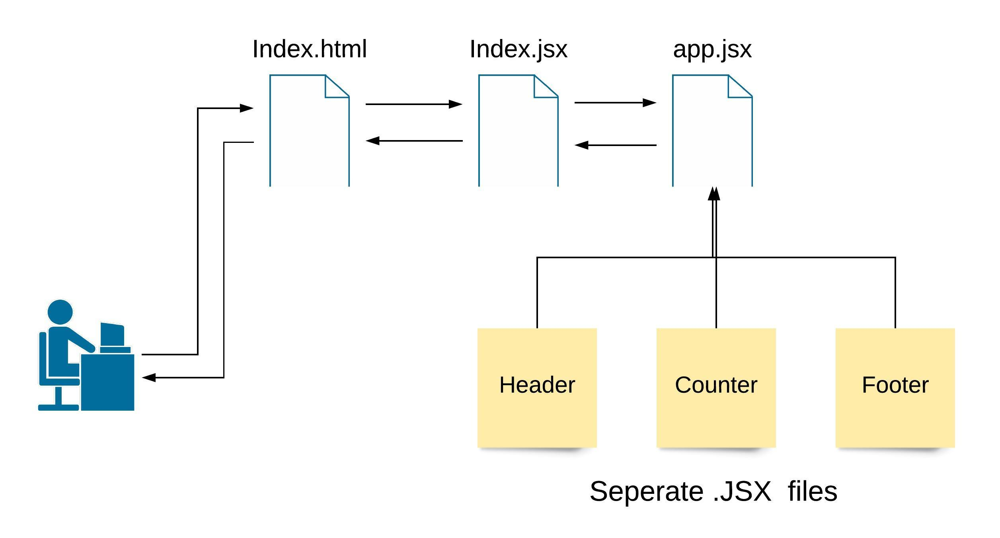

# Component-Based-UI
##### *Author: Alex Pena*
---
## React Web Application
Currently has 2 buttons, one to increment and one to decrement. There is also a button for setting a new starting value.

---
### Identity Claims
*none*

---
### Tools Used
- HTML
- CSS
- React
- JavaScript

---
### Getting Started

Clone this repository to your local machine.

- `$ git clone (enter REPO URL here)`
- `$ npm install`
- Enjoy!

---
### Visuals

---
### Data Flow
`
- `$ npm install`
- Enjoy!

---
### Visuals

---
### Data Flow

---
### Database Schema

---
### Change Log

---
### Sources)

---
### Database Schema

---
### Change Log

---
### Sources